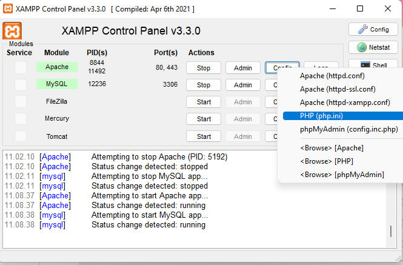

| Nama      | Faris Syahluthfi |
| ----------- | ----------- |
| NIM     | 312010034      |
| Kelas   | TI.20.A.1        |

### Pengerjaan
1. Buka xampp control lalu kalian klik start dan klik config lalu pilih PHP(php.ini)<br>
<br>
2. Lalu kalian hapus tanda (;) pada bagian extension=intl seperti berikut<br>
<br>
3. Untuk melakukan instalasi Codeigniter 4 dapat dilakukan dengan dua cara, yaitu cara manual dan menggunakan composer. Pada praktikum ini kita menggunakan cara
manual.
- Unduh Codeigniter dari website https://codeigniter.com/download
- Extrak file zip Codeigniter ke direktori htdocs/lab11_ci.
- Ubah nama direktory framework-4.x.xx menjadi ci4.
- Buka browser dengan alamat http://localhost/lab11_ci/ci4/public/

4. Kalian buka CMD dengan cara buka kembali xampp control lalu pilih bagian Shell, selanjutnya kalian tulis seperti dibawah ini<br>
<br>
5. Selanjutnya kalian tulis php spark maka akan muncul seperti dibawah ini<br>
<br>
6. Selanjutnya kita akan mengaktifkan fitur debugging untuk mengatahui pesan error, jika belum aktif maka tampilannya akan seperti dibawah ini<br>
<br>
7. Untuk mengaktifkannya kalian buka env ubah atau rename menjadi .env, lalu kalian hapus (#) pada CI_ENVIRONMENT dan ubah juga menjadi development seperti berikut<br>
<br>
8. Lalu coba kita hapus tanda (;) pada Home.php maka akan memunculkan info terjadi kesalahan pada bagian tertentu seperti dibawah ini<br>
<br>
9. Setelah semua selesai, disini saya akan membuat router baru seperti berikut di File Routes terletak pada file app/config/Routes.php<br>
<br>
10. Lalu kita cek lagi apakah router sudah benar pada Shell di xampp control tadi dengan tulis php spark routes, jika sudah maka tampilannya akan menjadi seperti berikut<br>
<br>
11. Lalu kita cek about di web page, maka tampilannya akan seperti berikut<br>
<br>
12. Selanjutnya kita akan membuat controller dengan membuat file baru dengan nama page.php pada folder Controllers<br>
```php
<?php
namespace App\Controllers;
class Page extends BaseController
{
    public function about()
    {
        return view('about', [
            'title' => 'Halaman About',
            'content' => 'Ini adalah halaman about yang menjelaskan tentang isi halaman ini.'
        ]);
        
    }

    public function contact()
    {
        echo "Ini adalah halaman Contact";
    }

    public function faqs()
    {
        echo "Ini adalah halaman FAQ";
    }
    public function TOS()
    {
        echo "Ini adalah halaman Term Of Services";
    }
    public function article()
    {
        return view('article', [
            'title' => 'Halaman Article',
            'content' => 'Ini Adalah Halaman Article'
        ]);
    }
}
```
Berikut tampilannya<br>
<br>
13. Selanjutnya kita akan membuat auto routing disini kalian bisa menambahkan syntax dibawah ini pada folder config > Routes.php<br> Dan juga syntax berikut pada folder Controllers > page.php<br>
Maka tampilannya akan menjadi berikut ini<br>
```php
$routes->setAutoRoute(true);
```

```php
public function TOS()
    {
        echo "Ini adalah halaman Term Of Services";
    }
```
<br>

14.Buat file css pada direktori ``public`` dengan nama ``style.css`` (copy file dari praktikum ``lab4_layout``. Kita akan gunakan layout yang pernah dibuat pada praktikum 4.

<br>

Kemudian buat folder template pada direktori view kemudian buat file ``header.php`` dan ``footer.php``
```php
<!DOCTYPE html>
<html lang="en">
<head>
    <meta charset="UTF-8">
    <title><?= $title; ?></title>
    <link rel="stylesheet" href="<?= base_url('/style.css');?>">
</head>
<body>
    <div id="container">
        <header>
            <h1>Layout Sederhana</h1>
        </header>
        <nav>
            <a href="<?= base_url('/');?>" class="active">Home</a>
            <a href="<?= base_url('/artikel');?>">Artikel</a>
            <a href="<?= base_url('/about');?>">About</a>
            <a href="<?= base_url('/contact');?>">Kontak</a>
        </nav>
        <section id="wrapper">
            <section id="main">
```
<br>

File ``app/view/template/footer.php``
<br>

Kemudian ubah file ``app/view/about.php`` seperti berikut.
```php
<?= $this->include('template/header'); ?>
<h1><?= $title; ?></h1>
<hr>
<p><?= $content; ?></p>
<?= $this->include('template/footer'); ?>
```
<br>

Selanjutnya refresh tampilan pada alamat http://localhost:8080/about

<br>


### Jawaban Pertanyaan & Tugas
- Ubah isi pada Routes.php menjadi berikut,

<br>


- Pada ``Controllers/page.php``, menjadi berikut
```php
<?php
namespace App\Controllers;

class Page extends BaseController
{
    public function rumah()
    {
        return view('rumah', [
        'title' => 'Halaman Home',
        'content' => 'Ini adalah halaman home yang menjelaskan tentang isi
        halaman ini.'
        ]);
    }

    public function about()
    {
        return view('about', [
        'title' => 'Halaman About',
        'content' => 'Ini adalah halaman about yang menjelaskan tentang isi 
        halaman ini.'
        ]);
    }

    public function contact()
    {
        return view('contact', [
        'title' => 'Halaman Contact',
        'content' => 'Ini adalah halaman contact yang menjelaskan tentang isi 
        halaman ini.'
        ]);
    }

    public function artikel()
    {
        return view('artikel', [
        'title' => 'Halaman Artikel',
        'content' => 'Ini adalah halaman artikel yang menjelaskan tentang isi 
        halaman ini.'
        ]);
    }

    public function faqs()
    {
        return view('faqs', [
            'title' => 'Halaman FAQ',
            'content' => 'Ini adalah halaman FAQ yang menjelaskan tentang isi 
            halaman ini.'
            ]);
    }

    public function tos()
    {
        return view('tos', [
        'title' => 'Halaman TOS',
        'content' => 'Ini adalah halaman Terms of Service yang menjelaskan tentang isi 
        halaman ini.'
        ]);
    }
}
```

Pada masing-masing file di dalam Views, buat file baru denga nama : ``rumah.php``,``about.php``,``artikel.php``,``contact.php``,``faqs.php``, dan ``tos.php``. Masukan kode dibawah ini ke semua file tersebut
```php
    <?= $this->include('template/header'); ?>
    <h1><?= $title; ?></h1>
    <hr>
    <p><?= $content; ?></p>
    <?= $this->include('template/footer'); ?>
```
Untuk melihat hasilnya dengan menggunakan
alamat: http://localhost:8080/contact

<br>


