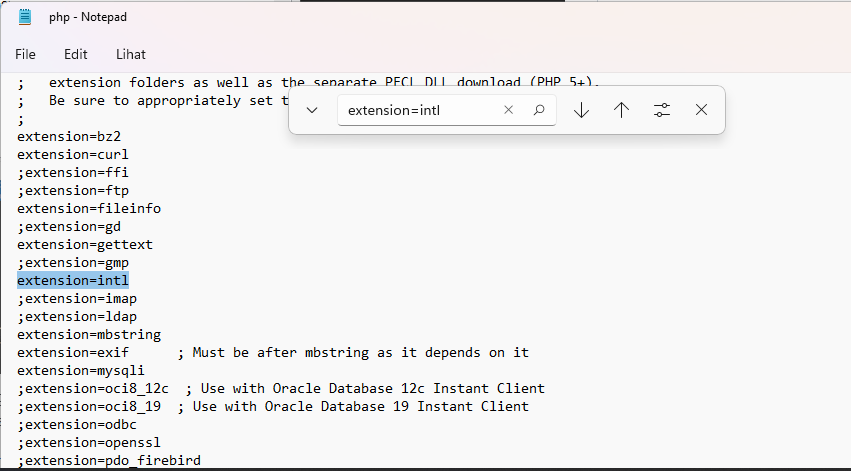
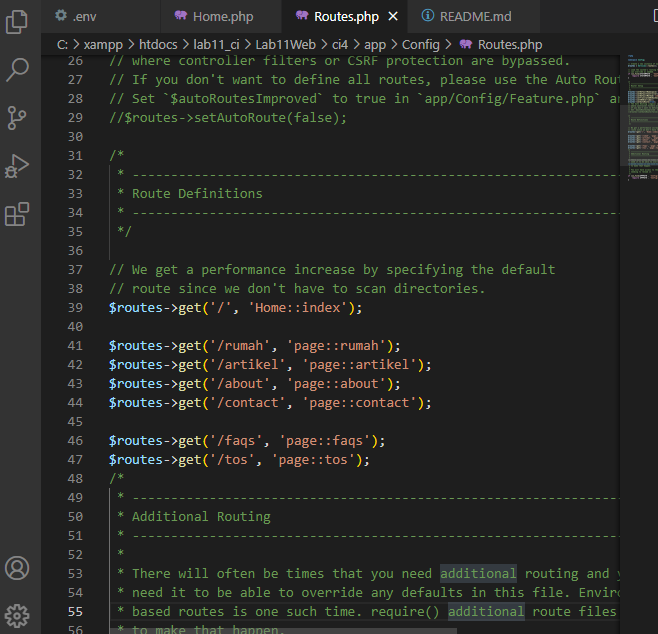

| Nama      | Faris Syahluthfi |
| ----------- | ----------- |
| NIM     | 312010034      |
| Kelas   | TI.20.A.1        |

### Pengerjaan
1. Buka xampp control lalu kalian klik start dan klik config lalu pilih PHP(php.ini)<br>
<br>
2. Lalu kalian hapus tanda (;) pada bagian extension=intl seperti berikut<br>
<br>
3. Untuk melakukan instalasi Codeigniter 4 dapat dilakukan dengan dua cara, yaitu cara manual dan menggunakan composer. Pada praktikum ini kita menggunakan cara
manual.
- Unduh Codeigniter dari website https://codeigniter.com/download
- Extrak file zip Codeigniter ke direktori htdocs/lab11_ci.
- Ubah nama direktory framework-4.x.xx menjadi ci4.
- Buka browser dengan alamat http://localhost/lab11_ci/Lab11Web/ci4/public/

4. Kalian buka CMD dengan cara buka kembali xampp control lalu pilih bagian Shell, selanjutnya kalian tulis seperti dibawah ini<br>
<br>
5. Selanjutnya kalian tulis php spark maka akan muncul seperti dibawah ini<br>
<br>

## Mengaktifkan Mode Debugging
Codeigniter 4 menyediakan fitur debugging untuk memudahkan developer untuk 
mengetahui pesan error apabila terjadi kesalahan dalam membuat kode program.
Secara default fitur ini belum aktif. Ketika terjadi error pada aplikasi akan ditampilkan 
pesan kesalahan seperti berikut:
<br>

Semua jenis error akan ditampilkan sama. Untuk memudahkan mengetahui jenis 
errornya, maka perlu diaktifkan mode debugging dengan mengubah nilai konfigurasi 
pada environment variable CI_ENVIRINMENT menjadi development.<br>
<br>

Ubah nama file env menjadi .env kemudian buka file tersebut dan ubah nilai variable 
CI_ENVIRINMENT menjadi development.

Contoh error yang terjadi. Untuk mencoba error tersebut, ubah kode pada file 
app/Controller/Home.php hilangkan titik koma pada akhir kode
```php

<?php

namespace App\Controllers;

class Home extends BaseController
{
    public function index()
    {
        return view('welcome_message')
    }
}

```
## Routing dan Controller
Routing merupakan proses yang mengatur arah atau rute dari request untuk menentukan 
fungsi/bagian mana yang akan memproses request tersebut. Pada framework CI4, 
routing bertujuan untuk menentukan Controller mana yang harus merespon sebuah 
request. Controller adalah class atau script yang bertanggung jawab merespon sebuah 
request.
Pada Codeigniter, request yang diterima oleh file index.php akan diarahkan ke Router 
untuk meudian oleh router tesebut diarahkan ke Controller.<br>
<br>

## Membuat Route Baru.
Tambahkan kode berikut di dalam Routes.php
```php
$routes->get('/about', 'Page::about');
$routes->get('/contact', 'Page::contact');
$routes->get('/faqs', 'Page::faqs');
```
Untuk mengetahui route yang ditambahkan sudah benar, buka CLI dan jalankan perintah berikut:<br>
php spark routes<br>
<br>

Selanjutnya coba akses route yang telah dibuat dengan mengakses alamat url: http://localhost/lab11_ci/Lab11Web/ci4/public/about

## Membuat Controller
Selanjutnya adalah membuat Controller Page. Buat file baru dengan nama page.php 
pada direktori Controller kemudian isi kodenya seperti berikut.<br>
```php
<?php
namespace App\Controllers;
class Page extends BaseController
{
 public function about()
 {
 echo "Ini halaman About";
 }
 public function contact()
 {
 echo "Ini halaman Contact";
 }
 public function faqs()
 {
 echo "Ini halaman FAQ";
 }
}
```
Selanjutnya refresh Kembali browser, maka akan ditampilkan hasilnya yaotu halaman 
sudah dapat diakses.<br>
<br>

## Auto Routing
Secara default fitur autoroute pada Codeiginiter sudah aktif. Untuk mengubah status 
autoroute dapat mengubah nilai variabelnya. Untuk menonaktifkan ubah nilai true
menjadi false.
```php
$routes->setAutoRoute(true);
```
Tambahkan method baru pada Controller Page seperti berikut.<br>
```php
public function tos()
{
 echo "ini halaman Term of Services";
}
```

## Membuat View
Selanjutnya adalam membuat view untuk tampilan web agar lebih menarik. Buat file 
baru dengan nama about.php pada direktori view (app/view/about.php) kemudian isi 
kodenya seperti berikut.<br>
```php
<!DOCTYPE html>
<html lang="en">
<head>
 <meta charset="UTF-8">
 <title><?= $title; ?></title>
</head>
<body>
 <h1><?= $title; ?></h1>
 <hr>
 <p><?= $content; ?></p>
</body>
</html>
```
Ubah method about pada class Controller Page menjadi seperti berikut:<br>
```php
public function about()
{
 return view('about', [
 'title' => 'Halaman Abot',
 'content' => 'Ini adalah halaman abaut yang menjelaskan tentang isi 
halaman ini.'
 ]);
}
```


